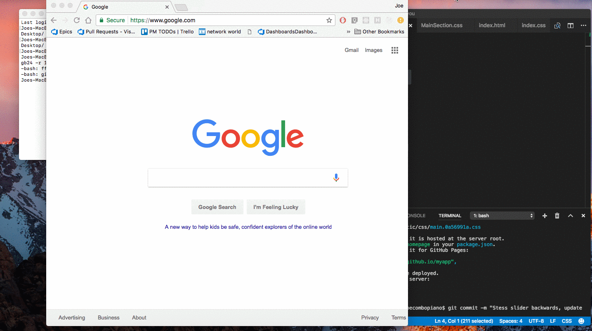

How are you is a chrome extension built using React and Redux. It helps you log soft data points which are otherwise more difficult to quantiy.

# Scripts
To start the development server: 
```
npm run start
```
To build:
```
npm run build
```

# Demo

